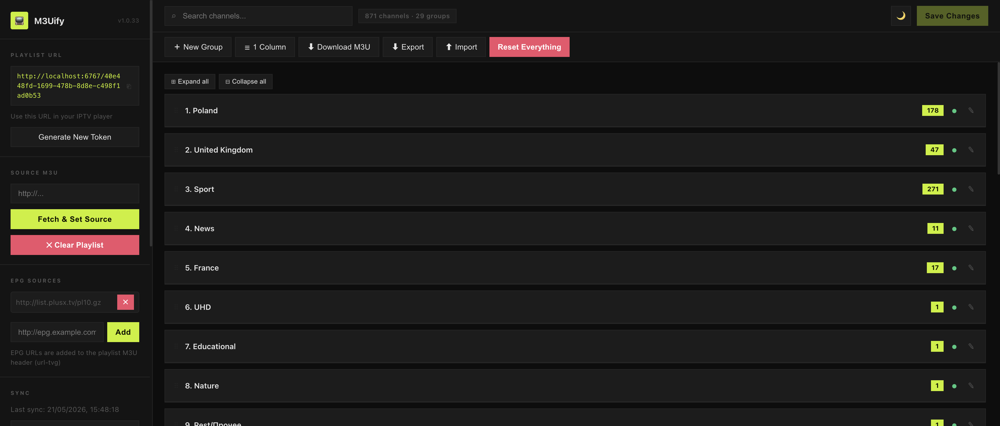
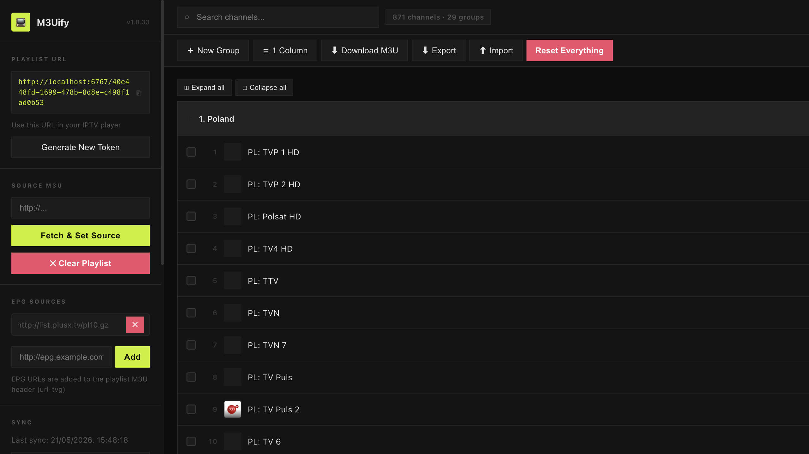
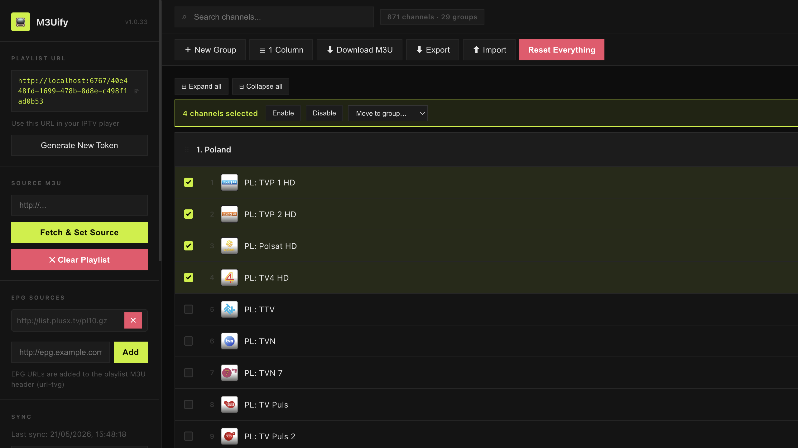
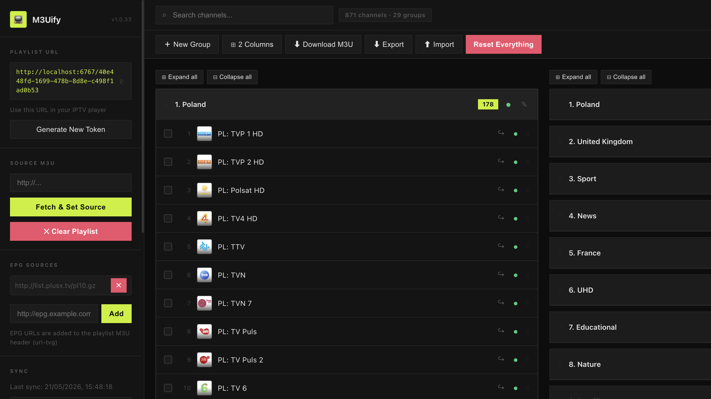
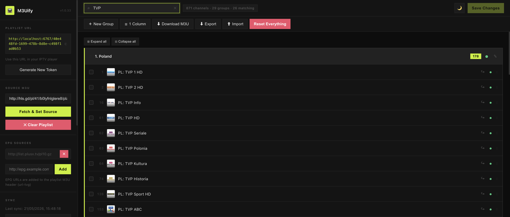
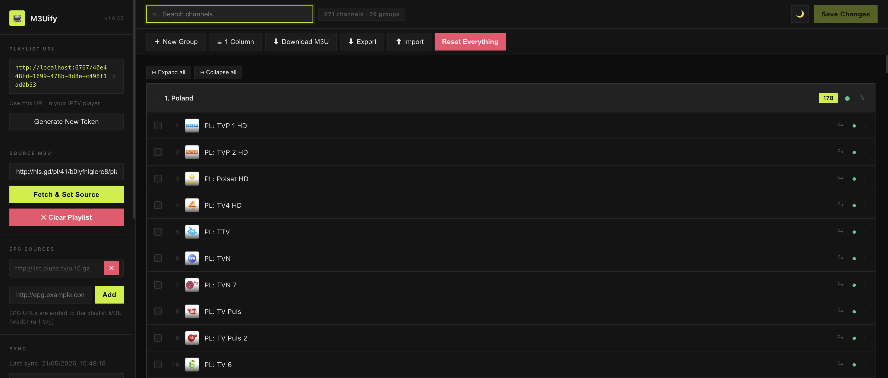
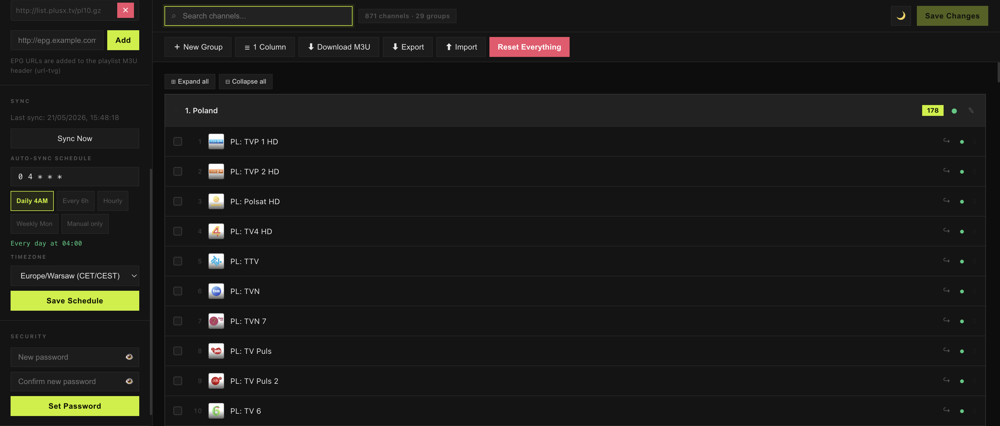
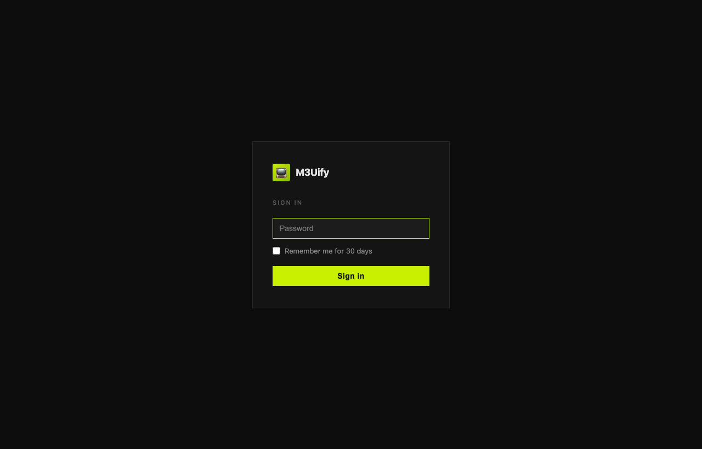

# M3Uify

Web-based IPTV playlist manager — fetch, organise, and serve a custom-ordered M3U playlist to your IPTV player.

## Screenshots

**Overview — sidebar with playlist URL (copy button), source URL input (placeholder `http://...`), EPG Sources section, auto-sync schedule, and security section; two-row toolbar; collapsed group list**


**Channels — expanded group with numbered channels, per-row checkbox for bulk selection, logos, move (↪), toggle (●), and drag handle**


**Bulk selection — checkboxes checked on multiple channels reveal the bulk-action toolbar: selected count, Enable, Disable, Move to group… dropdown, and ✕ Deselect all; shift-click selects a range**


**Two-column layout — split-pane for reorganising groups side by side; each pane has its own Expand all / Collapse all toolbar**


**Live search — search input (placeholder `Search channels…`) filters in real time; toolbar shows total channels · groups · matching count**


**EPG Sources — add one or more EPG XML URLs; each entry shows a remove (✕) button; the input field shows the placeholder `http://epg.example.com/guide.xml`; URLs are written into the served M3U header as `url-tvg`**


**Security — set / change / remove dashboard password directly from the sidebar (no restart required); password inputs have show/hide (👁) toggles**


**Login — optional password-protected sign-in page with "Remember me for 30 days" checkbox; theme follows your dark/light OS preference**


## Features

**Playlist management**

- Fetch an M3U playlist from a source URL and serve a clean, reordered copy to your IPTV player
- Channels grouped automatically by `group-title`
- Channel logos displayed inline with index number and fallback placeholder
- Live search / filter across all channels with real-time match count
- **✕ Clear Playlist** — wipes the loaded playlist and source URL without touching the token

**Ordering & organisation**

- Drag & drop to reorder channels within a group
- Drag & drop to reorder groups
- Drag channels across groups (drop onto a group header)
- Move a channel to a different group via the ↪ **Move To** dropdown
- Inline group renaming (✎ button)
- Create custom groups with **＋ New Group**; delete custom groups (🗑 button) — channels are restored to their original group
- Enable/disable individual channels (● toggle per channel)
- Enable/disable entire groups (● toggle per group header) — disabled groups are excluded from the served playlist
- **Multi-select bulk actions** — click the checkbox on any channel to select it; shift-click to select a range; a bulk-action toolbar appears showing the selected count with options to **Enable**, **Disable**, **Move to group**, or **Deselect all** in one action
- **Expand All / Collapse All** buttons per pane
- Changes tracked with an unsaved-indicator; persist with **Save Changes**

**UI**

- Dark and light theme — toggle in the toolbar; preference persisted to `localStorage`
- Responsive layout — sidebar collapses into a slide-in drawer on smaller screens (☰ toggle)
- Two-column split-pane view for side-by-side group management (⊞ layout button, preference persisted)

**Sync**

- **Sync Now** — re-fetches the source and merges changes immediately
- **Auto-sync** — configurable cron schedule (default: daily at 04:00); presets: Daily 4AM · Every 6h · Hourly · Weekly Mon · Manual only
- Smart merge: adds new channels, removes deleted ones, preserves your custom ordering and disabled flags
  - Channels matched by URL, then `tvg-id`, then name — survives token rotations in the source URL
- Rate-limit: automatic background syncs are throttled to at most once every 5 minutes

**Playlist serving**

- Serves your reordered, filtered playlist at a secret token URL: `http://localhost:6767/<token>`
- Disabled groups and disabled channels are excluded from the served M3U automatically
- **EPG Sources** — add one or more EPG XML URLs from the sidebar; they are written into the `#EXTM3U` header as `url-tvg` so your IPTV player picks them up automatically; each URL can be removed individually
- Token stored in `./data/config.json`; regenerate at any time from the UI (old URL stops working immediately)
- **⬇ Download M3U** — download the current modified playlist as a `.m3u` file

**Security (optional)**

- Password-protect the dashboard — set, change, or remove a password from the **Security** section in the sidebar without restarting
- Passwords stored as PBKDF2-SHA256 hashes in `data/config.json` (your Docker volume) — no plaintext secrets on disk
- Alternatively, set the `ADMIN_PASSWORD` environment variable; when set, the UI defers to it and hides the password form
- Session cookies signed with HMAC-SHA256; invalidated automatically when the password changes
- Brute-force protection: 5 failed attempts → 15-minute lockout per IP
- "Remember me for 30 days" checkbox on the login page
- IPTV player token URLs (e.g. `/:uuid`) are always public — no cookie required

**Backup & restore**

- **⬇ Export** — download a full JSON backup of all settings (channels, groups, disabled state, custom groups, source URL, cron schedule)
- **⬆ Import** — restore from a JSON backup; all settings including the cron schedule are applied immediately without a page reload
- **Reset Everything** — re-fetches the original source, discards all customisations, and resets the schedule to daily 04:00

**Extra M3U attributes** (`timeshift`, `catchup`, etc.) are parsed and round-tripped correctly.

## Run locally

```bash
nvm use          # switches to the pinned Node version (.nvmrc)
npm install
npm start
```

Open **http://localhost:6767** in your browser.

For development with auto-restart and live browser reload:

```bash
npm run dev
```

## First-time setup

1. Open **http://localhost:6767**
2. Paste your M3U source URL into the **Source M3U** field in the sidebar
3. Click **Fetch & Set Source** — channels load, grouped by `group-title`
4. Organise to your preference:
   - Drag groups or channels to reorder; drop a channel onto a group header to move it across groups
   - Toggle groups/channels on or off with ●
   - Rename groups with ✎; create new ones with ＋ New Group
   - Click a channel checkbox to select it; shift-click to select a range; use the bulk toolbar to enable, disable, or move multiple channels at once
5. Click **Save Changes**
6. Copy the **Playlist URL** from the sidebar into your IPTV player
7. _(Optional)_ Open the **EPG Sources** section in the sidebar, paste your EPG XML URL (placeholder: `http://epg.example.com/guide.xml`), and click **Add** — the URL is written into the `#EXTM3U` header so your player loads the guide automatically
8. _(Optional)_ Scroll to the **Security** section in the sidebar and set a password to protect the dashboard

## API

| Method   | Path                    | Description                                         |
| -------- | ----------------------- | --------------------------------------------------- |
| `GET`    | `/api/playlist`         | Current playlist state + token + auth status        |
| `POST`   | `/api/source`           | Set source URL and sync                             |
| `POST`   | `/api/import`           | Import M3U text or URL (merges into existing)       |
| `POST`   | `/api/save`             | Persist channel/group order, disabled flags         |
| `POST`   | `/api/sync`             | Force re-sync from saved source URL                 |
| `POST`   | `/api/reset`            | Reset to original source; clears all customisations |
| `POST`   | `/api/clear`            | Wipe playlist and source URL; returns empty state   |
| `GET`    | `/api/download`         | Download modified playlist as `playlist.m3u`        |
| `GET`    | `/api/epg`              | Get list of EPG source URLs                         |
| `POST`   | `/api/epg`              | Add an EPG source URL (`{ url }`)                   |
| `DELETE` | `/api/epg`              | Remove an EPG source URL (`{ url }`)                |
| `GET`    | `/api/backup/export`    | Download full JSON backup of all settings           |
| `POST`   | `/api/backup/import`    | Restore from a JSON backup                          |
| `GET`    | `/api/cron`             | Get current auto-sync schedule                      |
| `POST`   | `/api/cron`             | Set auto-sync schedule (`{ expression }`)           |
| `GET`    | `/api/token`            | Get current token and playlist URL                  |
| `POST`   | `/api/token/regenerate` | Generate a new secret token                         |
| `POST`   | `/api/auth/password`    | Set / change / remove dashboard password            |
| `GET`    | `/auth/logout`          | Clear session cookie and redirect to login          |
| `GET`    | `/:token`               | Serve the filtered playlist as `audio/x-mpegurl`    |

## Docker

### Pull from Docker Hub

```bash
docker run -d \
  --name m3uify \
  -p 6767:6767 \
  -v /path/to/iptv-data:/app/data \
  --restart unless-stopped \
  mlyczko/m3uify:latest
```

### Build locally

```bash
docker build -t m3uify .

docker run -d \
  --name m3uify \
  -p 6767:6767 \
  -v /path/to/iptv-data:/app/data \
  --restart unless-stopped \
  m3uify
```

### Docker Compose

```bash
docker compose up -d
```

The secret token is stored in `/app/data/config.json`. Mount that directory to a host path to keep it across container recreations.

### Releases

Every push to `main` automatically builds and pushes a versioned image to Docker Hub via GitHub Actions (e.g. `mlyczko/m3uify:1.0.1` and `mlyczko/m3uify:latest`). The image version tracks `package.json`, which is auto-incremented on each commit.

## Configuration

| Setting            | How to set                                            | Default                    |
| ------------------ | ----------------------------------------------------- | -------------------------- |
| Port               | `PORT` env var                                        | `6767`                     |
| Data directory     | hardcoded `./data/`                                   | auto-created               |
| Timezone           | `TZ` env var (e.g. `Europe/Warsaw`)                   | system / container default |
| Auto-sync schedule | UI → Sync section, or `POST /api/cron`                | `0 4 * * *` (daily 04:00)  |
| Dashboard password | UI → Security section **or** `ADMIN_PASSWORD` env var | _(none — open access)_     |

### Password setup for Docker Hub users

No password is set by default. Two options:

**Option A — from the UI** (no restart required):

Open the dashboard → scroll to **Security** in the sidebar → enter a new password → click **Set Password**. The hash is stored in `data/config.json` (your mounted volume) and survives restarts.

**Option B — environment variable**:

```yaml
services:
  m3uify:
    image: mlyczko/m3uify:latest
    environment:
      - ADMIN_PASSWORD=yourpassword
      - TZ=Europe/Warsaw # optional — sets timezone for cron schedules
    volumes:
      - ./data:/app/data
    ports:
      - "6767:6767"
    restart: unless-stopped
```

When `ADMIN_PASSWORD` is set, the Security form in the sidebar is hidden and the env var takes precedence over any stored hash.

> **Timezone note** — the auto-sync cron schedule runs in the timezone of the container. On NAS devices (e.g. QNAP) the container is UTC by default. Set the `TZ` environment variable (e.g. `TZ=Europe/Warsaw`) so that "Daily 4AM" fires at 4 AM your local time.
